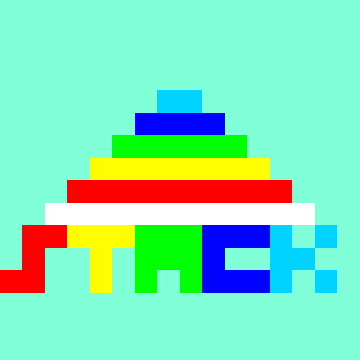

# Rock-A-Stack
A virtual ring stacker for Python.
# Warning
This virtual toy is only for use with children who can read, type, and count. These abilities are needed in order to understand the program.
# How to use
Make sure you have python installed. Then, download the rock-a-stack.py file and run it.\
The program WILL NOT print correctly if ran in Python IDLE. Python IDLE does not parse ANSI escape codes. I reccomend downloading the file itself, and double-clicking on it in the file explorer.

